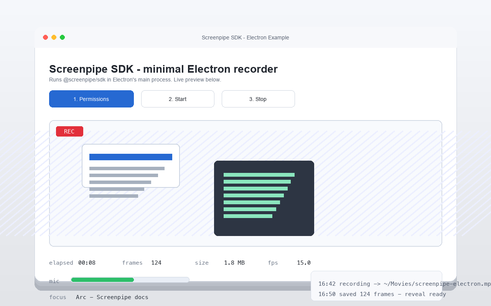
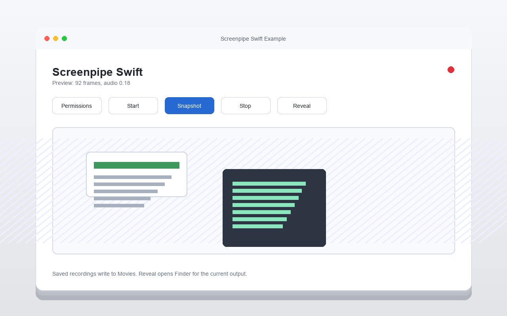

# Example Apps

The repo carries one runnable example per host framework. Each example is kept
small and uses the SDK surface an app would use in production.

| App | Preview | Run | Smoke check |
| --- | --- | --- | --- |
| [Electron](./electron-app) |  | `npm --prefix examples/electron-app install && npm --prefix examples/electron-app start` | `npm --prefix examples/electron-app run smoke` |
| [Swift](./swift-app) |  | `swift run --package-path examples/swift-app Project 362Example` | `SCREENPIPE_SWIFT_EXAMPLE_SMOKE=1 swift run --package-path examples/swift-app Project 362Example` |
| [Tauri](./tauri-app) |  | `npm --prefix examples/tauri-app install && npm --prefix examples/tauri-app run dev` | `npm --prefix examples/tauri-app run smoke` |

## Node Scripts

Standalone Node demos of the Node SDK surface — run after building the native
addon (see below). Each prints what it's doing and degrades gracefully when a
permission is missing.

| Script | What it shows |
| --- | --- |
| [`record-10s.mjs`](./record-10s.mjs) | Minimal: record the screen for 10s to an MP4. |
| [`record-with-paired-10s.mjs`](./record-with-paired-10s.mjs) | Multi-monitor + paired capture: MP4(s) plus a queryable `db.sqlite`. |
| [`record-with-privacy-filter.mjs`](./record-with-privacy-filter.mjs) | Privacy filters: exclude sensitive windows/URLs via `ignoredWindows`/`ignoredUrls`, poll `filterStatus()`, and toggle a rule at runtime with `setFilters()`. |
| [`preflight-and-record.mjs`](./preflight-and-record.mjs) | Pre-flight permission gate + a live `audioLevel()` mic meter + `focusedApp()` accessibility check, then record only if screen is granted. |

```bash
node examples/record-with-privacy-filter.mjs
node examples/preflight-and-record.mjs
```

## Before Running UI Apps

Build the native addon from the repo root:

```bash
bun install
bun run build
```

The headless smoke checks use the checked-out package directly and are safe for
CI. The UI apps may prompt for Screen Recording, Microphone, and Accessibility
permissions depending on the platform and which features you press.

## Full Example Validation

```bash
node --test --test-concurrency=1 __test__/examples_e2e.test.mjs
```

Set `SCREENPIPE_RUN_NATIVE_EXAMPLE_BUILDS=1` to include the optional native
Tauri example compile.
